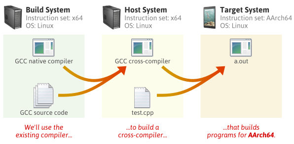
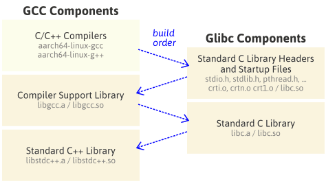

Generally, it can be a quite complicated task to setup a cross-compile toolchain for your target CPU. Here we'll give some basic directions/guidelines to make this process a bit more clear and smoother.

## Toolchain anatomy


- **What is a cross-compiling toolchain?**  
    A set of tools that allows to build source code into binary code for a target platform different than the one where the build takes place, e.g:
    - Different CPU architecture (e.g. arm, mips, powerpc, i386, ...): `arch`
    - Different ABI (e.g in arm: eabi): `abi`
    - Different OS (usually none or linux): `os`
        - `none`: bare-metal toolchain
        - `linux`: Linux toolchain
    - Different C lib (e.g. glibc, musl, newlib): `libc`

    This maps to the "system definitions" in `autoconf`: `<arch>-<vendor>-<os>-<libc/abi>`
    Example: `arm-unknown-linux-gnueabihf` [Linux toolchain targeting ARM arch, using the EABI-hf ABI and the glibc C lib, from an unknown vendor]

    Three machines involved in the build process:
    - build machine (where the build takes place)
    - host machine (where the execution takes place)
    - target machine (for which the programs generate code)

      
    In the native toolchain: `build == host == target`
    In the cross-compilation toolchain: `build == host != target`


- **Toolchain components**  
    There are 4 major components in a toolchain:
    1. binutils
    2. gcc
    3. Linux kernel headers
    4. C lib

    #### 1. binutils
    - Main ones: `ld` (linker) and `as` (assembler)
    - Debugging/analysis ones: `readelf`, `objdump`, `objcopy`, `nm`, `strings`, ...

    #### 2. gcc
    - Frontends (for many source languages - e.g. C, C++, Go, ...)
    - Backends (for many CPU architectures)  
    Provides the compiler (e.g. `gcc`, `g++`) and the target libraries: e.g. the gcc runtime (`libgcc`) and the  
    C++ library (`libstdc++`)

    - Built something like this (for C/C++):
        ```
        $ mkdir -p build-gcc
        $ cd build-gcc
        $ ../gcc-VERSION_NUMBER/configure --prefix=<INSTALLATION_PATH> --target=<TARGET_ARCH> --enable-languages=c,c++ --disable-multilib
        $ make -j4 all-gcc
        $ make install-gcc
        $ cd ..
        ```
    #### 3. Linux kernel headers
    - In order to build a C library, the Linux kernel headers are needed: definitions of  
    system call numbers, various structure types and definitions.
    - Installation using: `make ARCH=<TARGET_ARCH> INSTALL_HDR_PATH=<INSTALLATION_PATH> headers_install`
    - Which version should I choose?  
        The kernel to userspace ABI is backward compatible. So, the version of the kernel used for the  
        kernel headers must be the same version or older than the kernel version running on the target system.  
        ▶Toolchain using 3.10 kernel headers, running 4.4 kernel on the target --> OK  
        ▶Toolchain using 4.8 kernel headers, running 4.4 kernel on the target --> NOT OK
    #### 4. C lib
    Some examples below - you can find detailed comparisons [here](http://www.etalabs.net/compare_libcs.html).  
    - `glibc`: Standard GNU C library. Relatively big (MBs range) - Used for Linux platforms  
    - `musl`: Common choice for targets with RAM/storage constraints (KBs range) - Used for Linux platforms  
    - `newlib`: Common choice for bare-metal embedded platforms. Smallest of the 3, but not feature complete

- **Build process**  
The build process for a regular Linux cross-compilation toolchain goes like this:
    1. Build dependencies of binutils/gcc (GMP, MPFR, ISL, etc.)
    2. Build binutils
    3. Build a first stage gcc: no support for a C library, support only for static linking
    4. Extract & install the Linux kernel headers
    5. Build the C library using the first stage gcc
    6. Build the final gcc, with C library and support for dynamic linking  



## Getting the toolchain

There are 2 ways to get a toolchain:  
- Get a pre-built one, e.g. from [ARM](https://www.linaro.org/downloads/), [Bootlin](https://toolchains.bootlin.com/) (several architectures) or just your distro's one - if it fits your needs (e.g.  [gcc-arm-linux-gnueabihf ](https://packages.ubuntu.com/search?keywords=gcc-arm-linux-gnueabihf) from Ubuntu)
- Build it yourself
    - Manually collect all the toolchain components and set-up your own custom scripts to put all the pieces together - That's the most customizable/configurable option, but also the most painful to properly get it working
    - Via crosstool-NG: Very configurable and versatile
    - Embedded Linux rootfs build systems (Yocto/OpenEmbedded, Buildroot, OpenWRT)

    Here we'll focus on building it ourselves via crosstool-ng:
    An easy-to-use tool to create stand-alone toolchains for Embedded Linux is [crosstool-ng](https://github.com/crosstool-ng/crosstool-ng).  

    ### crosstool-ng
    It’s an open-source utility that supports different architectures including ARM, x86, PowerPC, and MPIC, and has a menuconfig-style interface, similar to the one of Linux kernel.

    Clone it:
    ```
    $ git clone https://github.com/crosstool-ng/crosstool-ng
    $ cd crosstool-ng/
    $ git checkout crosstool-ng-1.26.0
    ```

    Build crosstool-ng:
    ```
    $ ./bootstrap
    $ ./configure --enable-local
    $ make
    ```

    Verify it's built:
    ```
    $ ./ct-ng help
    ```

    To check all the ready-to-use configurations:
    ```
    $ ./ct-ng list-samples
    ```

    To load a configuration:
    ```
    $ ./ct-ng <sample-name>
    ```

    #### Known issues when building crosstool-ng
    - Source archives not found on the Internet  

        It is frequent that Crosstool-ng aborts because it can’t find a source archive on the Internet,
        when such an archive has moved or has been replaced by more recent versions. New Crosstool-ng
        versions ship with updated URLs, but in the meantime, you need work-arounds.
        If this happens to you, what you can do is look for the source archive by yourself on the Internet,
        and copy such an archive to the src directory in your home directory. Note that even source
        archives compressed in a different way (for example, ending with .gz instead of .bz2) will be
        fine too. Then, all you have to do is run ./ct-ng build again, and it will use the source archive
        that you downloaded.


    Now go to the guides for setting up the toolchain for popular targets:
    - [Raspberry Pi](../raspberry-pi/build-toolchain.md)
    - BeagleBone Black (**TODO!!!**)
    - Qemu (**TODO!!!**)


## References

Most of these notes are based on these great references, and you should check them out if you wanna dig deeper!

- https://bootlin.com/pub/conferences/2016/elce/petazzoni-toolchain-anatomy/petazzoni-toolchain-anatomy.pdf
- https://bootlin.com/doc/training/embedded-linux-4d/embedded-linux-4d-labs.pdf
- https://preshing.com/20141119/how-to-build-a-gcc-cross-compiler
- https://www.amazon.com/Mastering-Embedded-Linux-Programming-potential/dp/1789530385